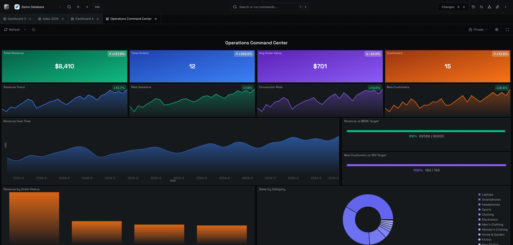
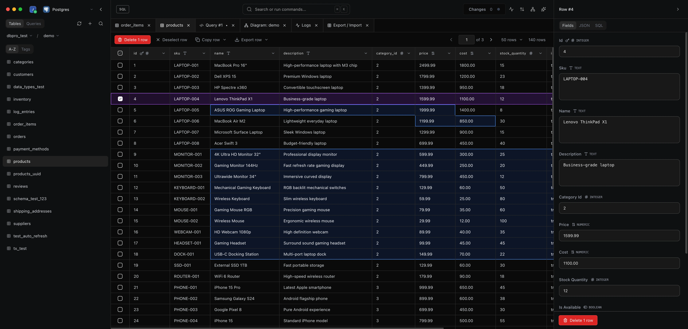
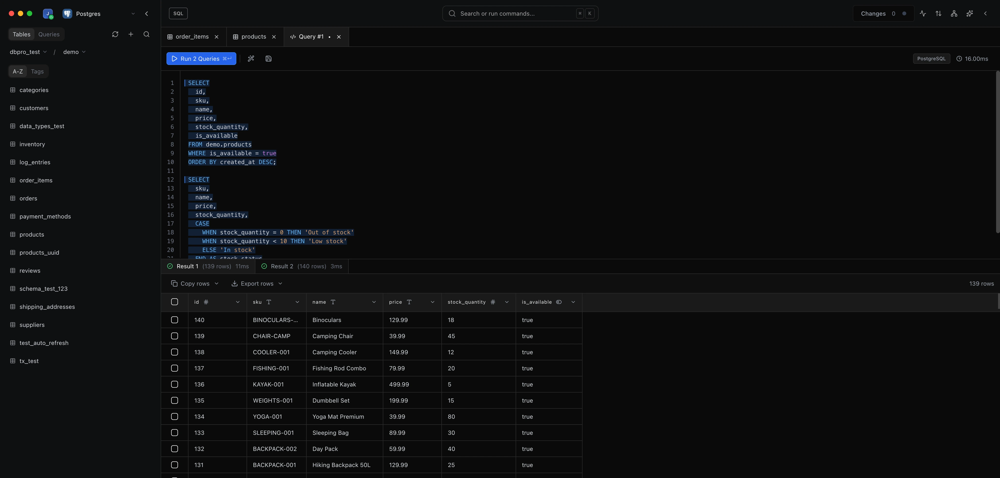
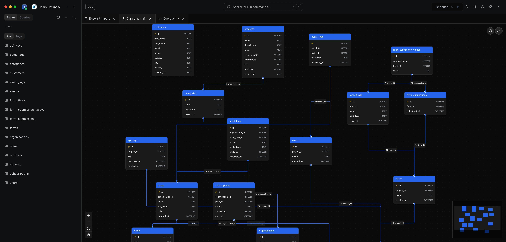
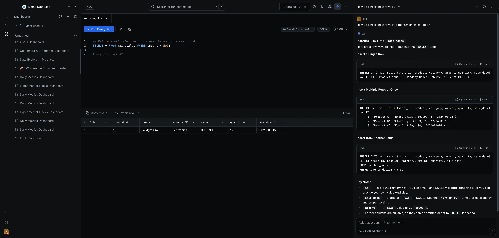

<h1 align="center">DB Pro Studio</h1>

<p align="center">
  <strong>Self-host DB Pro in your browser — the modern database workbench, running on your own infrastructure.</strong>
</p>

<p align="center">
  <a href="https://dbpro.app"></a>&nbsp;
  <a href="https://github.com/dbprohq/db-pro/releases/latest"></a>&nbsp;
  &nbsp;
  <a href="https://discord.com/invite/FKKF65msZY"></a>
</p>

<p align="center">
  
</p>

**DB Pro Studio** is the self-hostable, browser build of [DB Pro](https://dbpro.app). Run it on your own server and get the full workbench — data browser, SQL editor, visual schema diagrams, dashboards, and built-in AI — for Postgres, MySQL/MariaDB, SQLite, SQL Server, ClickHouse, MongoDB, Redis, Turso and more. Your database credentials and data stay on **your** infrastructure.

> Prefer a native app? Download DB Pro for macOS, Windows, and Linux at [dbpro.app/download](https://dbpro.app/download).

---

## Quick start

### Docker (recommended)

```bash
docker run -d --name dbpro-studio \
  -p 4000:3100 \
  -v dbpro-studio:/data \
  ghcr.io/dbprohq/dbpro-studio:latest
```

Then open **http://localhost:4000** and create your admin account on first visit.

The `dbpro-studio` volume holds your SQLite database and a generated encryption
key, so your data and saved connections survive restarts and upgrades.

### Node (no Docker)

Requires **Node.js 20+**.

```bash
curl -fsSL https://github.com/dbprohq/db-pro/releases/latest/download/dbpro-studio.tar.gz | tar xz
npm install --omit=dev
node bin/cli.js
```

Then open **http://localhost:3100**. Data and a generated encryption key live
under `~/.dbpro-studio`.

Grab a specific version from the [Releases](https://github.com/dbprohq/db-pro/releases) page.

---

## Configuration

Configure via environment variables:

| Variable | Default | Description |
|----------|---------|-------------|
| `PORT` | `3100` | Port the server listens on. |
| `DATABASE_PATH` | `~/.dbpro-studio/dbpro.db` (Node) · `/data/dbpro.db` (Docker) | SQLite/libSQL file that stores users, saved connections, queries, dashboards, etc. |
| `ENCRYPTION_KEY` | auto-generated | 64-char hex key used to encrypt saved connection credentials at rest. If unset, one is generated and persisted next to the database as `.encryption-key`. |
| `DEMO_MODE` | `false` | When `true`, seeds a read-only demo database to explore. |

**Back up your data directory** (the Docker volume or `~/.dbpro-studio`). It
contains both the database and the encryption key — **losing the encryption key
means saved connection credentials can no longer be decrypted.** To pin the key
explicitly, set `ENCRYPTION_KEY` yourself and keep it somewhere safe.

### Behind a reverse proxy / HTTPS

Studio serves the app and API on one port and detects HTTPS from the
`X-Forwarded-Proto` header, so it works behind nginx, Caddy, or a load balancer
terminating TLS. Forward traffic to the container's port (`3100`) and serve it
over HTTPS for secure session cookies.

## Updating

- **Docker:** `docker pull ghcr.io/dbprohq/dbpro-studio:latest`, then recreate the container (your `-v dbpro-studio:/data` volume carries your data across).
- **Node:** download the latest tarball and re-extract over your install; `~/.dbpro-studio` is untouched.

Studio versions track the DB Pro desktop app — see the [Releases](https://github.com/dbprohq/db-pro/releases) page.

---

## What's inside

### Data Browser
Filter, sort, and inline-edit across millions of rows with a spreadsheet-like interface, plus a record Inspector.

<p align="center"></p>

### SQL Editor
Write and run queries with syntax highlighting, autocomplete, and instant results. Save your favorites.

<p align="center"></p>

### Visual Schema & Diagrams
Explore your database structure and design ER diagrams to understand relationships at a glance.

<p align="center"></p>

### Built-in AI
Ask questions in plain English and let AI write the SQL. Bring your own API key (OpenAI, Anthropic, Google, Ollama, OpenRouter).

<p align="center"></p>

### Dashboards
Build dashboards to visualize your data and track key metrics, and share them with your team.

<p align="center"></p>

Also included: import/export (CSV/JSON), query history & logs, table tagging, multi-tab workflows, and SSH-tunnel connections.

---

## Supported databases

<p align="center">
  &nbsp;
  &nbsp;
  &nbsp;
  &nbsp;
  &nbsp;
  
</p>

<p align="center">
  &nbsp;
  &nbsp;
  &nbsp;
  &nbsp;
  &nbsp;
  
</p>

<br>

<p align="center">
  Need SSO/SAML, audit logs, and an SLA? See <a href="https://dbpro.app/pricing">Enterprise</a>.
</p>

---

<p align="center">
  <a href="https://dbpro.app">Website</a> &middot;
  <a href="https://dbpro.app/download">Desktop app</a> &middot;
  <a href="https://www.dbpro.app/help/">Docs</a> &middot;
  <a href="https://discord.com/invite/FKKF65msZY">Discord</a> &middot;
  <a href="https://x.com/dbproapp">Twitter</a>
</p>
